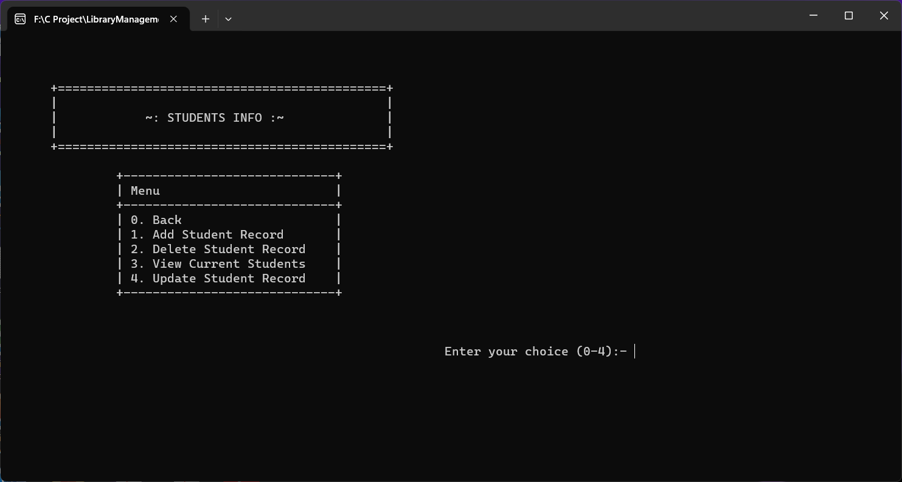

# LibraryManagementSystem
This is a Library Management System developed in C language.<br>
Developer -> Musaraf Hossain (Computer Science)
# Screenshots

## Main Menu


## Dashboard


## Book Search


## Student Search


## Book Check-In Record Section 


## Book Check-Out Record Section 


## Book Data Management Section 


## Book Record


## Student Data Management Section 


## Student Record


## Librarian Management Section 


## Librarian Record


## Help Section 


# Getting Started

### Installation
Download C compiler and set the C compiler path in the path variable.

### Initial Setup
Open the project folder from command prompt. To run the program, use the following CMD command:
```cmd
gcc main.c src/book/book.c src/checkinout/checkinout.c src/dashboard/dashboard.c src/librarian/librarian.c src/student/student.c src/library/library.c -o LibSys
```
and then hit the enter button and the program will be compiled and run. And also the LibSys.exe file is given where you can run directly. If you want to see the code then it is also given.

# Library Management System Documentation
## 1. Introduction
Welcome to the Library Management System documentation! This system is designed to help libraries efficiently manage their books and student records. This guide will help you understand, install, and use the system.

## 2. Key Features

### 2.1 Dashboard
The dashboard is your starting point. It helps you navigate to specific functions.

### 2.2 Borrowing Books
Allows you to borrow books from the library.

### 2.3 Returning Books
Helps library staff process book returns. Maintains a record of returned books.

### 2.4 Managing Books
Includes the following features:
1. **Adding Book Records:** Add new books to the library, including titles, authors, ISBN, and availability.
2. **Deleting Book Records:** Remove books that are no longer available.
3. **Viewing Current Books:** See a list of all library books.
4. **Updating Book Records:** Modify book information, including availability.
5. **Pending Books:** View books currently checked out.

### 2.5 Student Records
Includes the following features:
1. **Adding Student Records:** Create records with student names, roll numbers, class, stream, and contact information.
2. **Deleting Student Records:** Remove student records.
3. **Viewing Current Students:** Access a list of enrolled students.
4. **Updating Student Records:** Edit student information.

### 2.6 Librarian Details
Includes the following feature:
1. **Editing Librarian Info:** Add, delete, and view librarian records.

### 2.7 Help and Assistance
The help section provides guidance. It can be enhanced with more detailed explanations.

## 3. Using the System

### 3.1 Dashboard
Start your journey from the dashboard.

### 3.2 Borrowing Books
Borrow books from the library.

### 3.3 Returning Books
Library staff can process book returns. A history of returns is maintained.

### 3.4 Managing Books
Includes the following features:
1. **Adding Book Records:** Add book information.
2. **Deleting Book Records:** Remove books.
3. **Viewing Current Books:** See the library's book list.
4. **Updating Book Records:** Modify book information.
5. **Pending Books:** Check for books currently checked out.

### 3.5 Student Records
Includes the following features:
1. **Adding Student Records:** Create student records.
2. **Deleting Student Records:** Remove student records.
3. **Viewing Current Students:** Access a list of all students.
4. **Updating Student Records:** Edit student information.

### 3.6 Librarian Details
Includes the following feature:
1. **Editing Librarian Info:** Add, delete, and view librarian records.

### 3.7 Help and Assistance
The help section can provide detailed information on using system features and best practices. It should include explanations of commands, input formats, and common tasks.

## 4. Advanced Features
List additional features that could be added to enhance the system. For example: book reservation, availability check, fine calculation, advanced search, reporting, user authentication, data export.

## 5. System Structure
Describe the system's code structure and how modules are organized.

## 6. Dealing with Errors
Explain how the system handles errors and unusual situations.

## 7. Future Improvements
Suggest potential improvements to the system.

## 8. Conclusion
Conclude the documentation by summarizing the system's capabilities and importance.

---

**Developer**: Musaraf Hossain

